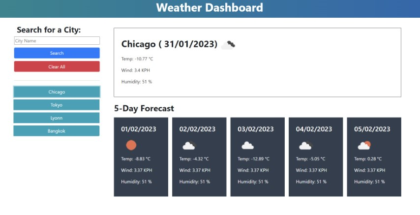

# weather-dahboard

 

## Description

I completed this project to implement skills acquired during the eight week of EDX front-end development bootcamp. I was tasked with creating an interactive online weather dashboard meeting the following requirements:

1. When a user searches for a city they are presented with current and future conditions for that city and that city is added to the search history
2. When a user views the current weather conditions for that city they are presented with:
- The city name
- The date
- An icon representation of weather conditions
- The temperature
- The humidity
- The wind speed
3. When a user view future weather conditions for that city they are presented with a 5-day forecast that displays:
- The date
- An icon representation of weather conditions
- The temperature
- The humidity

4. When a user click on a city in the search history they are again presented with current and future conditions for that city

The following screenshot presents the desired look of the deployed webapp:

Creating the quiz allowed me to

- Practice creating code in jQuery
- Practice using third part APIs
- Practice using various DOM manipulation method to create a dynamically changing website design
- Practice writing JavaScript functions and loops
- Practice sending and retrieving data to and from the browser's local storage
- Practice debugging my code.
- Practice GitHub workflow.

## Installation

No installation is required. The deployed quiz can be seen at https://manonthemon.github.io/weather-dahboard/. All project files files are available in the repository.  

## Usage

This project can serve those wiling to learn more about using JavaScript, jQuery and third party APIs to code dynamic, interactive websites. It is also a fully functional weather forecast dashboard.

## Copyright

In making of this application I have used the follwing APIs:

- https://openweathermap.org
- https://momentjs.com

I am the sole author of this project. In its making I used ideas and problem solutions from some of the following sources:

- https://stackoverflow.com
- https://www.w3schools.com
